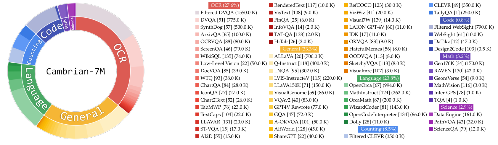
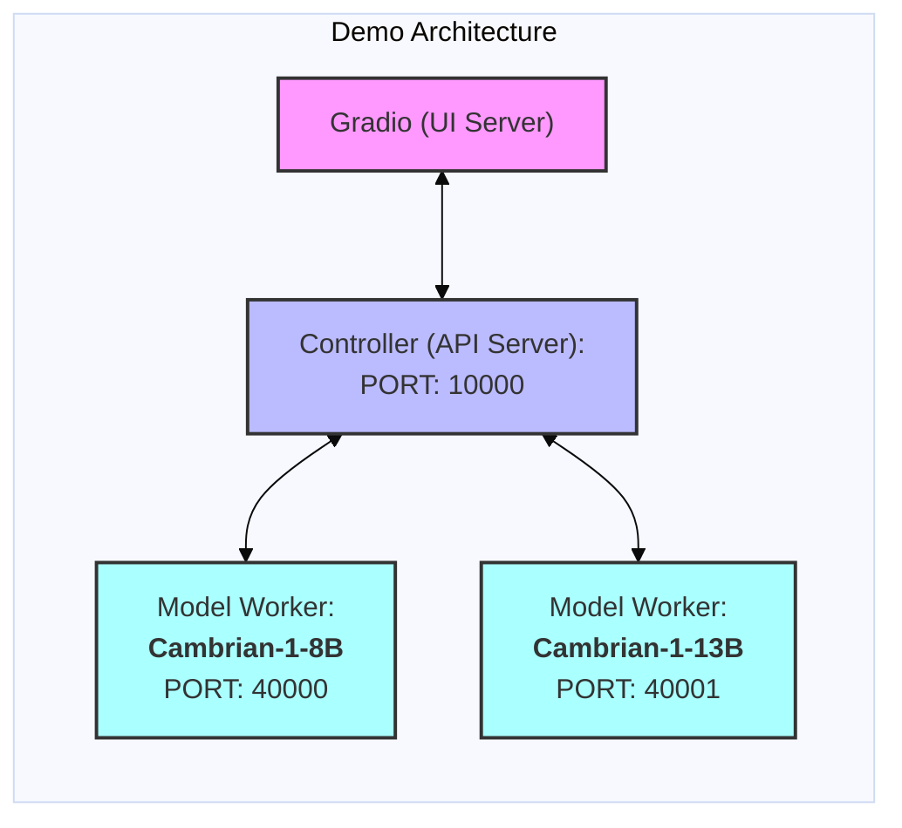

<div align="center">

#  🪼 *Cambrian-1*:<br> A Fully Open, Vision-Centric Exploration of Multimodal LLMs


<p>
    
</p>


<a href="https://arxiv.org/abs/2406.16860" target="_blank">
    
</a>
<a href="https://cambrian-mllm.github.io/" target="_blank">
    
</a>
<br>
<a href="https://huggingface.co/collections/nyu-visionx/cambrian-1-models-666fa7116d5420e514b0f23c" target="_blank">
    
</a>
<a href="https://huggingface.co/collections/nyu-visionx/cambrian-data-6667ce801e179b4fbe774e11" target="_blank">
    
</a>
<a href="https://huggingface.co/datasets/nyu-visionx/CV-Bench" target="_blank">
    
</a>


<div style="font-family: charter;">
    <a href="https://tsb0601.github.io/petertongsb/" target="_blank">Shengbang Tong*</a>,
    <a href="https://ellisbrown.github.io/" target="_blank">Ellis Brown*</a>,
    <a href="https://penghao-wu.github.io/" target="_blank">Penghao Wu*</a>,
    <br>
    <a href="https://sites.google.com/view/sanghyunwoo/" target="_blank">Sanghyun Woo</a>,
    <a href="https://www.linkedin.com/in/manoj-middepogu/" target="_blank">Manoj Middepogu</a>,
    <a href="https://www.linkedin.com/in/sai-charitha-akula-32574887/" target="_blank">Sai Charitha Akula</a>,
    <a href="https://jihanyang.github.io/" target="_blank">Jihan Yang</a>,
    <br>
    <a href="https://github.com/vealocia" target="_blank">Shusheng Yang</a>,
    <a href="https://adithyaiyer1999.github.io/" target="_blank">Adithya Iyer</a>,
    <a href="https://xichenpan.com/" target="_blank">Xichen Pan</a>,
    <a href="https://www.linkedin.com/in/ziteng-wang-694b8b227/" target="_blank">Austin Wang</a>,
    <br>
    <a href="http://cs.nyu.edu/~fergus" target="_blank">Rob Fergus</a>,
    <a href="http://yann.lecun.com/" target="_blank">Yann LeCun</a>,
    <a href="https://www.sainingxie.com/" target="_blank">Saining Xie</a>
</div>


</div>
<br>

> *Fun fact: vision emerged in animals during the Cambrian period! This was the inspiration for the name of our project, Cambrian.*

## Release
- [09/09/24] 🧪 We've released our MLLM evaluation suite with 26 benchmarks, supporting manual usage and parallelization using Slurm for HPC clusters. See the [`eval/`](eval/) subfolder for more details.
- [07/03/24] 🚂 We have released our targeted data engine! See the [`dataengine/`](dataengine/) subfolder for more details.
- [07/02/24] 🤗 CV-Bench is live on Huggingface! Please see here for more: https://huggingface.co/datasets/nyu-visionx/CV-Bench
- [06/24/24] 🔥 We released Cambrian-1! We also release three sizes of model (8B, 13B and 34B), training data, TPU training scripts. We will release GPU training script and evaluation code very soon.

## Contents
- [Installation](#installation)
- [Cambrian Weights](#cambrian-weights)
- [Cambrian Instruction Tuning Data](#cambrian-instruction-tuning-data)
- [Train](#train)
- [Evaluation](#evaluation)
- [Demo](#demo)

## Installation

### TPU Training
Currently, we support training on TPU using TorchXLA

1. Clone this repository and navigate to into the codebase
```bash
git clone https://github.com/cambrian-mllm/cambrian
cd cambrian
```

2. Install Packages
```Shell
conda create -n cambrian python=3.10 -y
conda activate cambrian
pip install --upgrade pip  # enable PEP 660 support
pip install -e ".[tpu]"
```

3. Install TPU specific packages for training cases
```
pip install torch~=2.2.0 torch_xla[tpu]~=2.2.0 -f https://storage.googleapis.com/libtpu-releases/index.html
```

### GPU Inference
1. Clone this repository and navigate to into the codebase
```bash
git clone https://github.com/cambrian-mllm/cambrian
cd cambrian
```

2. Install Packages
```Shell
conda create -n cambrian python=3.10 -y
conda activate cambrian
pip install --upgrade pip  # enable PEP 660 support
pip install ".[gpu]"
```

## Cambrian Weights

Here are our Cambrian checkpoints along with instructions on how to use the weights. Our models excel across various dimensions, at the 8B, 13B, and 34B parameter levels. They demonstrate competitive performance compared to closed-source proprietary models such as GPT-4V, Gemini-Pro, and Grok-1.4V on several benchmarks.

### Model Performance Comparison

| Model                   | # Vis. Tok. | MMB  | SQA-I | MathVistaM | ChartQA | MMVP  |
|-------------------------|-------------|------|-------|------------|---------|-------|
| GPT-4V                  | UNK         | 75.8 | -     | 49.9       | 78.5    | 50.0  |
| Gemini-1.0 Pro          | UNK         | 73.6 | -     | 45.2       | -       | -     |
| Gemini-1.5 Pro          | UNK         | -    | -     | 52.1       | 81.3    | -     |
| Grok-1.5                | UNK         | -    | -     | 52.8       | 76.1    | -     |
| MM-1-8B                 | 144         | 72.3 | 72.6  | 35.9       | -       | -     |
| MM-1-30B                | 144         | 75.1 | 81.0  | 39.4       | -       | -     |
| **Base LLM: Phi-3-3.8B** |     |      |       |            |         |       |
| [Cambrian-1-8B](https://huggingface.co/nyu-visionx/cambrian-phi3-3b) | 576 | 74.6| 79.2  | 48.4       | 66.8    | 40.0  |
| **Base LLM: LLaMA3-8B-Instruct** |     |      |       |            |         |       |
| Mini-Gemini-HD-8B       | 2880        | 72.7 | 75.1  | 37.0       | 59.1    | 18.7  |
| LLaVA-NeXT-8B           | 2880        | 72.1 | 72.8  | 36.3       | 69.5    | 38.7  |
| [Cambrian-1-8B](https://huggingface.co/nyu-visionx/cambrian-8b) | 576 | 75.9 | 80.4  | 49.0       | 73.3    | 51.3  |
| **Base LLM: Vicuna1.5-13B**       |     |      |       |            |         |       |
| Mini-Gemini-HD-13B      | 2880        | 68.6 | 71.9  | 37.0       | 56.6    | 19.3  |
| LLaVA-NeXT-13B          | 2880        | 70.0 | 73.5  | 35.1       | 62.2    | 36.0  |
| [Cambrian-1-13B](https://huggingface.co/nyu-visionx/cambrian-13b) | 576 | 75.7 | 79.3  | 48.0       | 73.8    | 41.3  |
| **Base LLM: Hermes2-Yi-34B**      |     |      |       |            |         |       |
| Mini-Gemini-HD-34B      | 2880        | 80.6 | 77.7  | 43.4       | 67.6    | 37.3  |
| LLaVA-NeXT-34B          | 2880        | 79.3 | 81.8  | 46.5       | 68.7    | 47.3  |
| [Cambrian-1-34B](https://huggingface.co/nyu-visionx/cambrian-34b) | 576 | 81.4 | 85.6  | 53.2       | 75.6    | 52.7  |

*For the full table, please refer to our Cambrian-1 paper.*

<p align="center">
    
</p>

Our models offer highly competitive performance while using a smaller fixed number of visual tokens.

### Using Cambrian-1

To use the model weights, download them from Hugging Face:

- [Cambrian-1-8B](https://huggingface.co/nyu-visionx/cambrian-8b)
- [Cambrian-1-13B](https://huggingface.co/nyu-visionx/cambrian-13b)
- [Cambrian-1-34B](https://huggingface.co/nyu-visionx/cambrian-34b)

We provide a sample model loading and generation script in [`inference.py`](inference.py).


## Cambrian-10M Instruction Tuning Data
<p align="center">
    
</p>


In this work, we collect a very large pool of instruction tuning data, Cambrian-10M, for us and future work to study data in training MLLMs. In our preliminary study, we filter the data down to a high quality set of 7M curated data points, which we call Cambrian-7M.
Both of these datasets are available in the following Hugging Face Dataset: [Cambrian-10M](https://huggingface.co/datasets/nyu-visionx/Cambrian-10M).

### Data Collection
We collected a diverse range of visual instruction tuning data from various sources, including VQA, visual conversation, and embodied visual interaction. To ensure high-quality, reliable, and large-scale knowledge data, we designed an Internet Data Engine.

Additionally, we observed that VQA data tends to generate very short outputs, creating a distribution shift from the training data. To address this issue, we leveraged GPT-4v and GPT-4o to create extended responses and more creative data.

#### Data Engine for Knowledge Data
To resolve the inadequacy of science-related data, we designed an Internet Data Engine to collect reliable science-related VQA data. This engine can be applied to collect data on any topic. Using this engine, we collected an additional 161k science-related visual instruction tuning data points, increasing the total data in this domain by 400%! If you want to use this part of data, please use this [jsonl](https://huggingface.co/datasets/nyu-visionx/Cambrian-10M/blob/main/jsons/data_engine_161k.jsonl).

#### GPT-4v Distilled Visual Instruction Tuning Data
We used GPT-4v to create an additional 77k data points. This data either uses GPT-4v to rewrite the original answer-only VQA into longer answers with more detailed responses or generates visual instruction tuning data based on the given image. If you want to use this part of data, please use this [jsonl](https://huggingface.co/datasets/nyu-visionx/Cambrian-10M/resolve/main/jsons/gpt4v_77k.jsonl).

#### GPT-4o Distilled Creative Chat Data
We used GPT-4o to create an additional 60k creative data points. This data encourages the model to generate very long responses and often contains highly creative questions, such as writing a poem, composing a song, and more. If you want to use this part of data, please use this [jsonl](https://huggingface.co/datasets/nyu-visionx/Cambrian-10M/blob/main/jsons/gpt4o_60k.jsonl).

### Data Curation

We conducted an initial study on data curation by:
1. Setting a threshold $t$ to filter the number of samples from a single data source.
2. Studying the data ratio.

Empirically, we found that setting $t$ to 350k yields the best results. Additionally, we conducted data ratio experiments and determined the following optimal data ratio:

| Category   | Data Ratio |
|------------|:----------:|
| **Language**   | 21.00%     |
| **General**    | 34.52%     |
| **OCR**        | 27.22%     |
| **Counting**   | 8.71%      |
| **Math**       | 7.20%      |
| **Code**       | 0.87%      |
| **Science**    | 0.88%      |

Compared to the previous LLaVA-665K model, scaling up and improved data curation significantly enhance model performance, as shown in the table below:

| Model          | Average | General Knowledge | OCR   | Chart | Vision-Centric |
|----------------|---------|-------------------|-------|-------|----------------|
| LLaVA-665K     | 40.4    | 64.7              | 45.2  | 20.8  | 31.0           |
| Cambrian-10M   | 53.8    | 68.7              | 51.6  | 47.1  | 47.6           |
| Cambrian-7M    | **54.8**| **69.6**          | **52.6** | **47.3** | **49.5**   |

### Adding System Prompt to Alleviate the "Answer Machine" Phenomenon

While training with Cambrian-7M provides competitive benchmark results, we observed that the model tends to output shorter responses and act like a question-answer machine. This behavior, which we refer as the "Answer Machine" phenomenon, can limit the model's usefulness in more complex interactions.

We found that adding a system prompt such as *"Answer the question using a single word or phrase."* can help mitigate the issue. This approach encourages the model to provide such concise answers only when it is contextually appropriate. For more details, please refer to our paper.

We have also curated a dataset, [Cambrian-7M *with* system prompt](https://huggingface.co/datasets/nyu-visionx/Cambrian-10M/blob/main/jsons/Cambrian7M_withsystemprompt.jsonl), which includes the system prompt to enhance the model's creativity and chat ability.

## Train

Below is the latest training configuration for Cambrian-1.

In the Cambrian-1 paper, we conduct extensive studies to demonstrate the necessity of two-stage training. Cambrian-1 training consists of two stages: 

1. **Visual Connector Training**: We use a mixed [2.5M Cambrian Alignment Data](https://huggingface.co/datasets/nyu-visionx/Cambrian-Alignment) to train a Spatial Vision Aggregator (SVA) that connects *frozen pretrained* vision encoders to a *frozen LLM*.
2. **Instruction Tuning**: We use [curated Cambrian-7M instruction tuning data](https://huggingface.co/datasets/nyu-visionx/Cambrian-10M) to train both the visual connector and LLM.

Cambrian-1 is trained on TPU-V4-512 but can also be trained on TPUs starting at TPU-V4-64. GPU training code will be released soon. For GPU training on fewer GPUs, reduce the `per_device_train_batch_size` and increase the `gradient_accumulation_steps` accordingly, ensuring the global batch size remains the same: `per_device_train_batch_size` x `gradient_accumulation_steps` x `num_gpus`.

### Hyperparameters

Both hyperparameters used in pretraining and finetuning are provided below.

#### 1. Visual Connector Training

| Base LLM          | Global Batch Size | Learning rate | SVA Learning Rate | Epochs | Max length |
|-------------------|-------------------:|--------------:|------------------:|-------:|-----------:|
| LLaMA-3 8B        | 512                | 1e-3          | 1e-4              | 1      | 2048       |
| Vicuna-1.5 13B    | 512                | 1e-3          | 1e-4              | 1      | 2048       |
| Hermes Yi-34B     | 1024               | 1e-3          | 1e-4              | 1      | 2048       |

#### 2. Instruction Tuning

| Base LLM          | Global Batch Size | Learning rate | Epochs | Max length |
|-------------------|-------------------:|--------------:|-------:|-----------:|
| LLaMA-3 8B        | 512                | 4e-5          | 1      | 2048       |
| Vicuna-1.5 13B    | 512                | 4e-5          | 1      | 2048       |
| Hermes Yi-34B     | 1024               | 2e-5          | 1      | 2048       |

For instruction finetuning, we conducted experiments to determine the optimal learning rate for our model training. Based on our findings, we recommend using the following formula to adjust your learning rate based on the availability of your device:

```text
optimal lr = base_lr * sqrt(bs / base_bs)
```


### Download LLM Checkpoints 

To get the base LLM and train the 8B, 13B, and 34B models:

- **LLaMA 8B Model**: Download the model weights from [Hugging Face](https://huggingface.co/meta-llama/Meta-Llama-3-8B-Instruct) and specify the model directory in the training script.
- **Vicuna-1.5-13B**: The Vicuna-1.5-13B model is automatically handled when you run the provided training script.
- **Yi-34B**: The Yi-34B model is also automatically handled when you run the provided training script.

### Training Spatial Vision Aggregator (SVA)

We use a combination of LLaVA, ShareGPT4V, Mini-Gemini, and ALLaVA alignment data to pretrain our visual connector (SVA). In Cambrian-1, we conduct extensive studies to demonstrate the necessity and benefits of using additional alignment data.

To begin, please visit our [Hugging Face alignment data page](https://huggingface.co/datasets/nyu-visionx/Cambrian-Alignment) for more details. You can download the alignment data from the following links:

- [Alignment Data (JSONL file)](https://huggingface.co/datasets/nyu-visionx/Cambrian-Alignment/blob/main/jsons/alignment_2.5m.jsonl)
- [Corresponding Images](https://huggingface.co/datasets/nyu-visionx/Cambrian-Alignment/tree/main)

We provide sample training scripts in:

- [scripts/cambrian/pretrain_cambrian_8b.sh](scripts/cambrian/pretrain_cambrian_8b.sh)
- [scripts/cambrian/pretrain_cambrian_13b.sh](scripts/cambrian/pretrain_cambrian_13b.sh)
- [scripts/cambrian/pretrain_cambrian_34b.sh](scripts/cambrian/pretrain_cambrian_34b.sh)

#### Using Custom Data

If you wish to train with other data sources or custom data, we support the commonly used LLaVA data format. For handling very large files, we use JSONL format instead of JSON format for lazy data loading to optimize memory usage.


### Instruction Tuning

Similar to Training SVA, please visit our [Cambrian-10M data](https://huggingface.co/datasets/nyu-visionx/Cambrian-10M) for more details on the instruction tuning data. 

- [Cambrian7M Data (JSONL file)](https://huggingface.co/datasets/nyu-visionx/Cambrian-10M/blob/main/jsons/Cambrian7M_withsystemprompt.jsonl)
- [Corresponding Images](https://huggingface.co/datasets/nyu-visionx/Cambrian-10M)

We provide sample training scripts in:

- [scripts/cambrian/finetune_cambrian_8b.sh](scripts/cambrian/finetune_cambrian_8b.sh)
- [scripts/cambrian/finetune_cambrian_13b.sh](scripts/cambrian/finetune_cambrian_13b.sh)
- [scripts/cambrian/finetune_cambrian_34b.sh](scripts/cambrian/finetune_cambrian_34b.sh)

### Options to note:

- `--mm_projector_type`: To use our SVA module, set this value to `sva`. To use the LLaVA style 2-layer MLP projector, set this value to `mlp2x_gelu`.
- `--vision_tower_aux_list`: The list of vision models to use (e.g. `'["siglip/CLIP-ViT-SO400M-14-384", "openai/clip-vit-large-patch14-336", "facebook/dinov2-giant-res378", "clip-convnext-XXL-multi-stage"]'`).
- `--vision_tower_aux_token_len_list`: The list of number of vision tokens for each vision tower; each number should be a square number (e.g. `'[576, 576, 576, 9216]'`). The feature map of each vision tower will be interpolated to meet this requirement.
- `--image_token_len`: The final number of vision tokens that will be provided to LLM; the number should be a square number (e.g. `576`). Note that if the `mm_projector_type` is mlp, each number in  `vision_tower_aux_token_len_list` must be the same as `image_token_len`.
The arguments below are only meaningful for SVA projector
- `--num_query_group`: The `G` value for SVA module.
- `--query_num_list`: A list of query numbers for each group of query in SVA (e.g. `'[576]'`). The length of the list should equal to `num_query_group`.
- `--connector_depth`: The `D` value for SVA module.
- `--vision_hidden_size`: The hidden size for SVA module.
- `--connector_only`: If true, the SVA module will only appear before the LLM, otherwise it will be inserted multiple times inside the LLM. The following three arguments are only meaningful when this is set to `False`.
- `--num_of_vision_sampler_layers`: The total number of SVA modules inserted inside the LLM.
- `--start_of_vision_sampler_layers`: The LLM layer index after which the insertion of SVA begins.
- `--stride_of_vision_sampler_layers`: The stride of the SVA module insertion inside the LLM.

## Evaluation
We have released our evaluation code in the [`eval/`](eval/) subfolder. Please see the README there for more details.

## Demo
The following instructions will guide you through launching a local Gradio demo with Cambrian. We provide a simple web interface for you to interact with the model. You can also use the CLI for inference. This setup is heavily inspired by [LLaVA](https://github.com/haotian-liu/LLaVA).

### Gradio Web UI
Please follow the steps below to launch a local Gradio demo. A diagram of the local serving code is below[^1].

[^1]: Copied from [LLaVA's diagram](https://github.com/haotian-liu/LLaVA?tab=readme-ov-file#gradio-web-ui).


<!-- TODO: add SGWorker -->

#### 1. Launch a controller
```Shell
python -m cambrian.serve.controller --host 0.0.0.0 --port 10000
```

#### 2. Launch a gradio web server.
```Shell
python -m cambrian.serve.gradio_web_server --controller http://localhost:10000 --model-list-mode reload
```
You just launched the Gradio web interface. Now, you can open the web interface with the URL printed on the screen. You may notice that there is no model in the model list. Do not worry, as we have not launched any model worker yet. It will be automatically updated when you launch a model worker.

#### Launch a SGLang worker

Coming soon.

#### Launch a model worker

This is the actual *worker* that performs the inference on the GPU.  Each worker is responsible for a single model specified in `--model-path`.

```Shell
python -m cambrian.serve.model_worker --host 0.0.0.0 --controller http://localhost:10000 --port 40000 --worker http://localhost:40000 --model-path nyu-visionx/cambrian-8b
```
Wait until the process finishes loading the model and you see "Uvicorn running on ...".  Now, refresh your Gradio web UI, and you will see the model you just launched in the model list.

You can launch as many workers as you want, and compare between different model checkpoints in the same Gradio interface. Please keep the `--controller` the same, and modify the `--port` and `--worker` to a different port number for each worker.
```Shell
python -m cambrian.serve.model_worker --host 0.0.0.0 --controller http://localhost:10000 --port <different from 40000, say 40001> --worker http://localhost:<change accordingly, i.e. 40001> --model-path <ckpt2>
```

If you are using an Apple device with an M1 or M2 chip, you can specify the mps device by using the `--device` flag: `--device mps`.

#### Launch a model worker (Multiple GPUs, when GPU VRAM <= 24GB)

If the VRAM of your GPU is less than 24GB (e.g., RTX 3090, RTX 4090, etc.), you may try running it with multiple GPUs. Our latest code base will automatically try to use multiple GPUs if you have more than one GPU. You can specify which GPUs to use with `CUDA_VISIBLE_DEVICES`. Below is an example of running with the first two GPUs.

```Shell
CUDA_VISIBLE_DEVICES=0,1 python -m cambrian.serve.model_worker --host 0.0.0.0 --controller http://localhost:10000 --port 40000 --worker http://localhost:40000 --model-path nyu-visionx/cambrian-8b
```

### CLI Inference

TODO


## Citation

If you find Cambrian useful for your research and applications, please cite using this BibTeX:
```bibtex
@misc{tong2024cambrian1,
      title={Cambrian-1: A Fully Open, Vision-Centric Exploration of Multimodal LLMs}, 
      author={Shengbang Tong and Ellis Brown and Penghao Wu and Sanghyun Woo and Manoj Middepogu and Sai Charitha Akula and Jihan Yang and Shusheng Yang and Adithya Iyer and Xichen Pan and Austin Wang and Rob Fergus and Yann LeCun and Saining Xie},
      year={2024},
      eprint={2406.16860},
}
```

## Acknowledgement

- [LLaVA](https://github.com/haotian-liu/LLaVA): We start from codebase from the amazing LLaVA
- [Vicuna](https://github.com/lm-sys/FastChat): We thank Vicuna for the initial codebase in LLM and the open-source LLM checkpoitns
- [LLaMA](https://github.com/meta-llama/llama3): We thank LLaMA for continuing contribution to the open-source community and providing LLaMA-3 checkpoints.
- [Yi](https://huggingface.co/NousResearch/Nous-Hermes-2-Yi-34B): We thank Yi for opensourcing very powerful 34B model. 


## Related Projects
- [Eyes Wide Shut? Exploring the Visual Shortcomings of Multimodal LLMs](https://tsb0601.github.io/mmvp_blog/)
- [V*: Guided Visual Search as a Core Mechanism in Multimodal LLMs](https://vstar-seal.github.io/)
- [V-IRL: Grounding Virtual Intelligence in Real Life](https://virl-platform.github.io/)


## License

[](https://github.com/cambrian-mllm/cambrian/blob/main/LICENSE)<br>
**Usage and License Notices**: This project utilizes certain datasets and checkpoints that are subject to their respective original licenses. Users must comply with all terms and conditions of these original licenses, including but not limited to the [OpenAI Terms of Use](https://openai.com/policies/terms-of-use) for the dataset and the specific licenses for base language models for checkpoints trained using the dataset (e.g. [Llama community license](https://ai.meta.com/llama/license/) for LLaMA-3, and Vicuna-1.5). This project does not impose any additional constraints beyond those stipulated in the original licenses. Furthermore, users are reminded to ensure that their use of the dataset and checkpoints is in compliance with all applicable laws and regulations.
